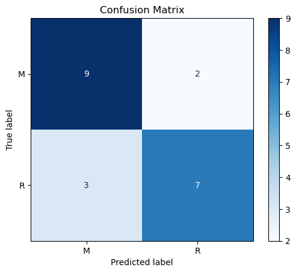

# SONAR Rock vs Mine Detection using Machine Learning

## Project Overview

This project uses machine learning to classify underwater objects as either **rocks** or **mines** based on SONAR signal data. The objective is to build a binary classification model that can accurately distinguish between the two classes using reflected sound wave measurements.

---

## Problem Statement

SONAR (Sound Navigation and Ranging) systems emit sound pulses and analyze the reflected signals from underwater objects. Different objects produce different reflection patterns.

The goal of this project is to predict whether an object is:

* **Rock (R)**
* **Mine (M)**

based on 60 numerical SONAR signal features.

---

## Dataset Information

* **Dataset:** Sonar Dataset
* **Number of Instances:** 208
* **Number of Features:** 60
* **Target Variable:** Rock (R) or Mine (M)

Each feature represents the energy of a SONAR signal within a particular frequency band.

---

## Technologies Used

* Python
* NumPy
* Pandas
* Matplotlib
* Scikit-learn
* Google Colab

---

## Machine Learning Workflow

### 1. Data Collection and Exploration

* Loaded the SONAR dataset
* Examined dataset structure and dimensions
* Analyzed class distribution

### 2. Data Preprocessing

* Checked for missing values
* Separated features and target labels
* Encoded categorical target values
* Performed train-test split

### 3. Model Training

**Algorithm Used:**

* Logistic Regression

The model was trained on the training dataset to learn patterns that distinguish rocks from mines.

### 4. Model Evaluation

The model was evaluated using:

* Accuracy Score
* Confusion Matrix
* Precision
* Recall
* F1 Score

---

## Results

| Metric | Score |
|----------|----------|
| Accuracy | 76% |
| Macro Precision | 0.76 |
| Macro Recall | 0.76 |
| Macro F1-Score | 0.76 |

---

## Visualizations

### Confusion Matrix



---
### Classification Report

| Class | Precision | Recall | F1-Score |
|---------|---------|---------|---------|
| Mine (M) | 0.75 | 0.82 | 0.78 |
| Rock (R) | 0.78 | 0.70 | 0.74 |

## Sample Prediction

The trained model can classify new SONAR readings as:

* Rock
* Mine

based on the learned patterns from historical data.

---

## Key Learnings

Through this project, I learned:

* Binary classification techniques
* Data preprocessing workflows
* Train-test splitting
* Logistic Regression implementation
* Model evaluation using multiple metrics
* Interpretation of confusion matrices

---

## Future Improvements

* Compare Logistic Regression with other classification algorithms
* Apply feature selection techniques
* Perform hyperparameter tuning
* Use cross-validation for more robust evaluation
* Explore ensemble learning methods

---

## Repository Structure

```text
sonar-rock-vs-mine-detection/
│
├── README.md
├── requirements.txt
├── Sonar_Rock_vs_Mine_Detection.ipynb
│
├── data/
│   └── sonar_data.csv
│
├── images/
│   ├── confusion_matrix.png
│
└── reports/
    └── project_summary.pdf
```

---

## Installation and Usage

Clone the repository:

```bash
git clone https://github.com/eknoor-kaur-kohli/SonarRockVsMinePrediction.git
```

Navigate to the project directory:

```bash
cd SonarRockVsMinePrediction
```

Install dependencies:

```bash
pip install -r requirements.txt
```

Open the notebook:

```bash
RockvsMine.ipynb
```

and run all cells.

---

## Author

Eknoor Kaur Kohli

Machine Learning Enthusiast | Computer Science Student
